# SplitEasy

Split shared expenses with friends, roommates and travel groups, on the web and on your phone.
SplitEasy keeps track of who paid what, shows everyone's balance in real time, and reduces a
tangle of debts to the smallest number of payments.

**Live demo:** https://spliteasy-beta-five.vercel.app

<p>
  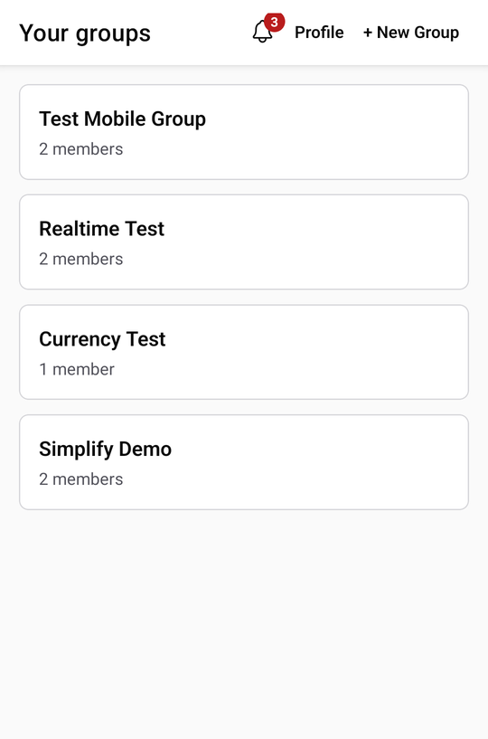
  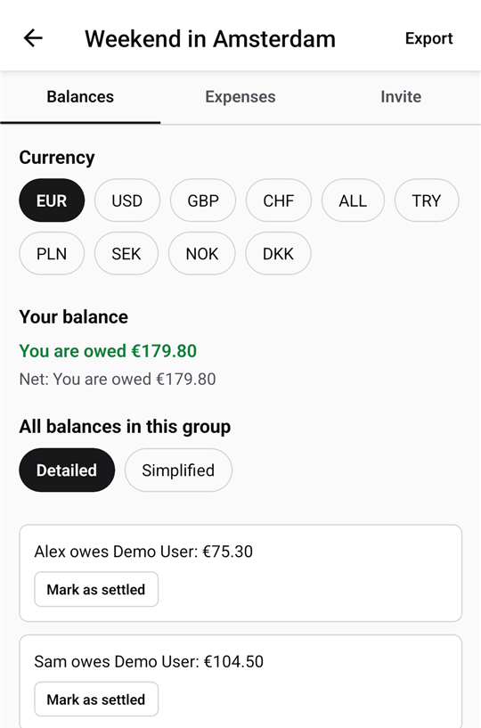
  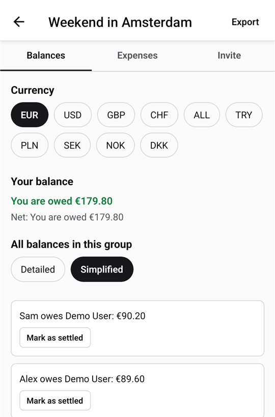
</p>

## Try it

Open the live demo at https://spliteasy-beta-five.vercel.app and click **Try the demo** on the sign-in page,
or sign in with the demo account yourself:

| Email | Password |
| --- | --- |
| `demo@spliteasy.dev` | `ZBXpYPJzfDw6TUDt5KXrLyYK-Aa7!` |

The demo account is shared, so other visitors may see or change the same data. It is reset every night at
03:00 UTC: groups created with it are removed and the "Weekend in Amsterdam" example group is restored. You can
also create your own account: sign-up takes you straight to your groups (no confirmation email in the public
demo).

### Download the Android app

A preview build of the Android app (APK, version 1.0.0) is available through EAS internal distribution:
**[Install SplitEasy for Android](https://expo.dev/accounts/tonydevcode/projects/spliteasy-mobile/builds/3a96b3ea-b3e7-42c3-b674-767fab759f5b)**
(open the link on an Android device, or scan the QR code on that page). It is a preview build, not a Play
Store release: Android asks you to allow installing apps from your browser. The app connects to the same
backend as the live demo, so **Try the demo** works there too.

## Features

- **Groups and invites** → create a group and invite people with a shareable invite link.
- **Equal or custom splits** → split an expense evenly or enter an exact amount per member.
- **Balances** → see what you owe and are owed, per person and in total.
- **Simplify debts** → switch between the detailed view and a minimal set of payments.
- **Settle up** → record a payment with "Mark as settled"; balances update immediately.
- **Realtime** → changes made by other members appear without refreshing (Supabase Realtime).
- **Receipts** → attach a photo of the receipt (camera or gallery on mobile, file upload on web), view it full size; files are validated before upload and stored privately in Supabase Storage.
- **Multi-currency** → every group has its own currency (EUR, USD, GBP, CHF, ALL, TRY, PLN, SEK, NOK, DKK).
- **Dark mode** → System, Light or Dark theme on web and mobile.
- **CSV and PDF export** → export a group's expenses, balances and settlements.
- **In-app notifications** → new members, expenses, settlements and currency changes, with unread badge.
- **Safe account deletion** → when a user is deleted, the group history stays intact: their expenses and
  splits remain and are shown as "Deleted user", and another member is promoted to group admin if needed.
  A group admin can **write off** a debt with a deleted user so the group can still become fully settled.

## Screenshots

| Expenses | Notifications | Profile and theme | Dark mode |
| --- | --- | --- | --- |
| 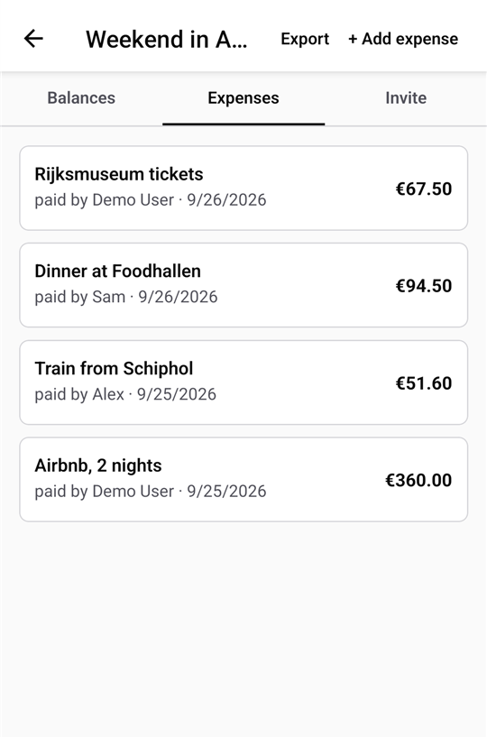 | 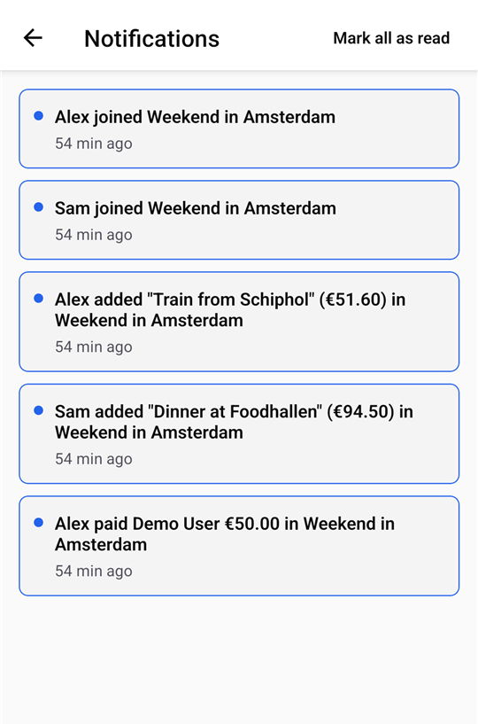 | 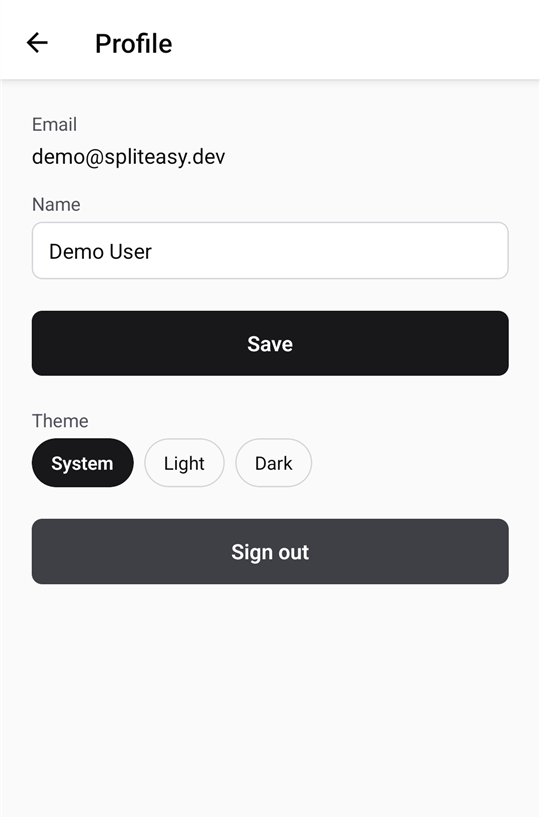 | 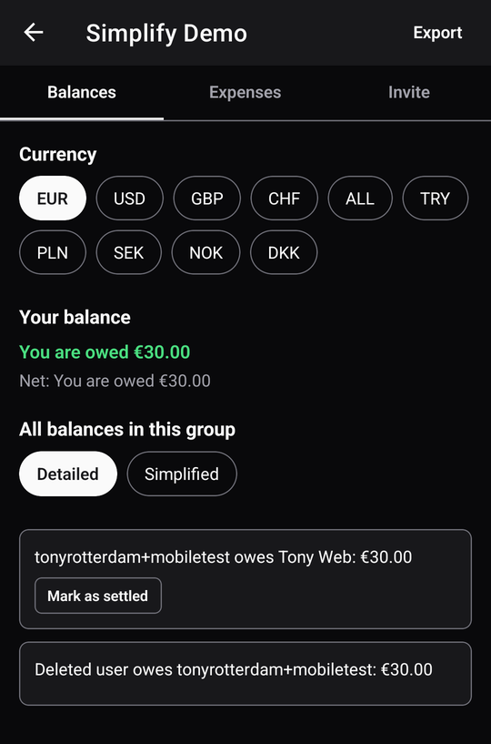 |

| Web: sign in | Web: sign up | Web: group |
| --- | --- | --- |
| 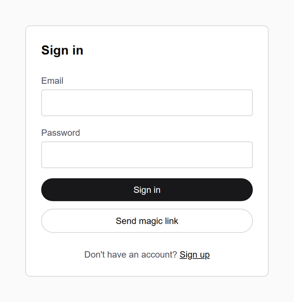 | 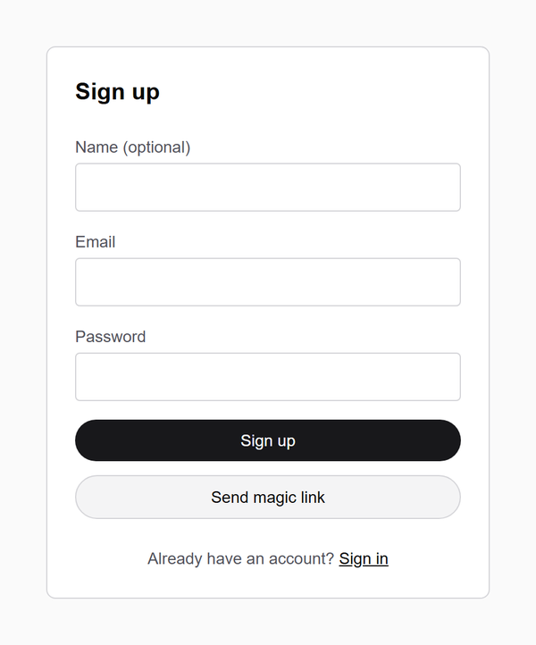 | 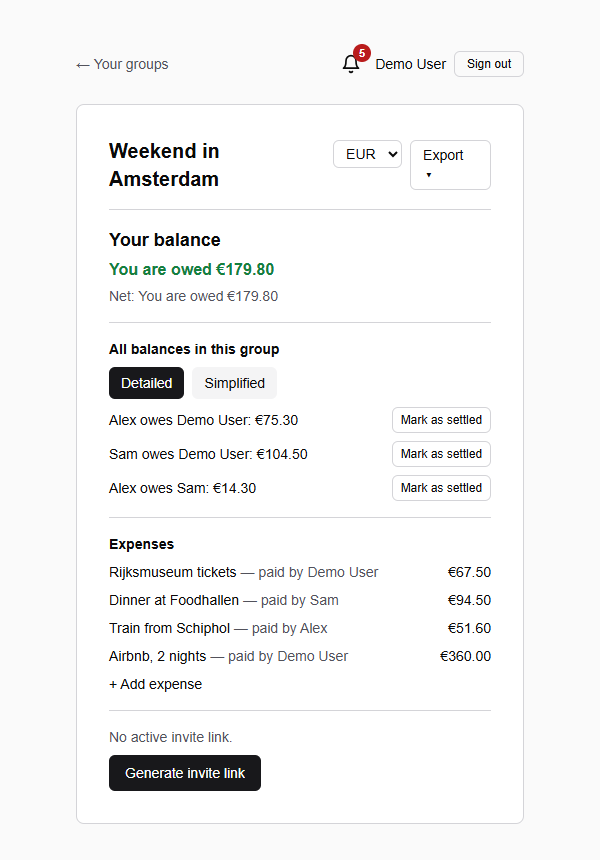 |

## Tech stack

| Layer | Technology |
| --- | --- |
| Web | Next.js 16 (App Router, Server Components), React 19, Tailwind CSS 4, deployed on Vercel |
| Mobile | React Native with Expo SDK 57 and Expo Router |
| Backend | Supabase: Postgres with Row Level Security, Auth, Realtime, Storage |
| Exports | jsPDF + jspdf-autotable (web), expo-print + expo-sharing (mobile) |
| Tests | Vitest |
| Language | TypeScript everywhere |

## Architecture

Both clients talk directly to Supabase with the user's own session. There is no custom API server:
authorization is enforced inside the database with Row Level Security, and side effects such as
notifications are handled by Postgres triggers.

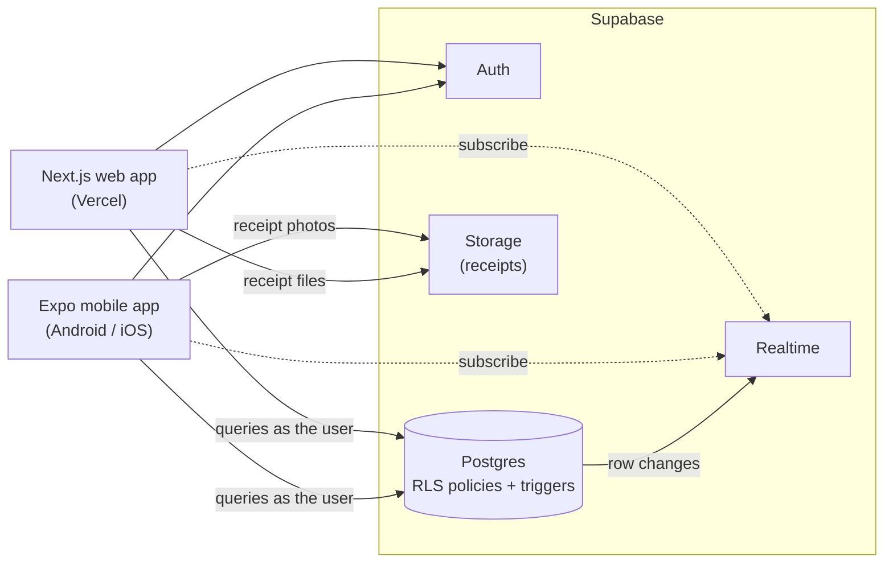

**Authorization lives in the database.** There is no privileged backend: the web app (including its
Next.js server code) and the mobile app only hold the public anon key and the signed-in user's own session,
so every permission check is enforced inside PostgreSQL, by Row Level Security policies plus a few
`security definer` functions (invite lookup, triggers). Even a modified client cannot read or change data in
groups the user is not a member of. Joining is checked in the database too: the `join_group_by_token`
function only adds the user when the invite token exists and has not expired, and direct inserts into
`group_members` are limited to the group creator (as the first member) and group admins. Admin-only actions
(editing a group, write-offs) are enforced the same way, through `is_group_admin`.

**Private receipts.** Receipt images live in a private Supabase Storage bucket protected by RLS: only members
of the group can upload or view them (only the uploader or a group admin can replace or delete one), and the
apps show them through signed URLs that expire after 60 minutes.

Shared business logic (balances, debt simplification, money formatting, display names, exports) lives
in `lib/` and is unit tested; the mobile app keeps equivalent modules in `mobile/lib/`.

```
app/                  Next.js routes (groups, invites, login, notifications, profile)
lib/                  Shared logic + Vitest tests
mobile/               Expo app (Expo Router screens in mobile/app, logic in mobile/lib)
supabase/migrations/  Database schema, RLS policies, functions and triggers
```

## Security

- **Row Level Security on every table.** Profiles, groups, group members, invites, expenses, expense splits,
  settlements and notifications each have explicit select/insert/update/delete policies. Access is scoped
  to group membership through the `is_group_member()` helper.
- **Admin-only group updates.** Only group admins (`is_group_admin()`) can change group settings such as
  the name or currency. If the last admin leaves or is deleted, the
  `promote_admin_after_member_removed` trigger promotes another member.
- **Admin-only write-offs.** A write-off is a settlement with `kind = 'write_off'`. Only group admins may
  insert one, and only for a debt with exactly one deleted side; regular members can only record payments
  between two existing users.
- **Security-definer functions with a narrow scope.** Triggers that create notifications or profiles, and the
  invite lookup by token, run as `security definer` so clients never need write access to those tables.
  Notifications can only be created by triggers; users can only read and mark their own as read.
- **User deletion keeps data consistent.** Foreign keys to users use `ON DELETE SET NULL`, so deleting an
  account never cascades away other people's expenses or settlements.
- **No secrets in the clients.** The apps only use the public anon key; the service role key is never
  bundled or committed.

## Testing

```bash
npm test
```

Runs the Vitest suite: 124 tests in 11 files covering balance calculation, debt simplification, write-offs,
money formatting, display names (including the "Deleted user" fallback), CSV/PDF export content,
notifications and theme handling.

Type checks and the production build:

```bash
npm run build                        # Next.js production build (includes type checking)
cd mobile && npx tsc --noEmit        # Mobile type check
```

## Local setup (fresh Windows PC)

**Prerequisites**

- [Node.js](https://nodejs.org) 22 LTS or newer (developed on Node 24) and Git.
- A [Supabase](https://supabase.com) project.
- For mobile: [Android Studio](https://developer.android.com/studio) with an emulator, or a phone with
  [Expo Go](https://expo.dev/go) (a version that supports SDK 57).

**1. Clone and install**

```powershell
git clone https://github.com/TonyDevCodes/spliteasy.git
cd spliteasy
npm install
cd mobile
npm install
cd ..
```

**2. Database**

Apply the SQL files in `supabase/migrations/` in order (Supabase CLI `npx supabase db push`, or paste them
into the SQL Editor). The migrations create everything the apps need, including Realtime for every table the
apps subscribe to and the private `receipts` Storage bucket with its upload policy, so no manual dashboard
steps are required.

**3. Environment variables**

Web – create `.env.local` in the repo root:

```
NEXT_PUBLIC_SUPABASE_URL=
NEXT_PUBLIC_SUPABASE_ANON_KEY=
NEXT_PUBLIC_SITE_URL=
# Optional: "Try the demo" button (both needed) and the magic-link button (off unless "true")
NEXT_PUBLIC_DEMO_EMAIL=
NEXT_PUBLIC_DEMO_PASSWORD=
NEXT_PUBLIC_MAGIC_LINK_ENABLED=
```

Mobile – create `mobile/.env`:

```
EXPO_PUBLIC_SUPABASE_URL=
EXPO_PUBLIC_SUPABASE_ANON_KEY=
EXPO_PUBLIC_SITE_URL=
# Optional: "Try the demo" button (both needed)
EXPO_PUBLIC_DEMO_EMAIL=
EXPO_PUBLIC_DEMO_PASSWORD=
```

Use the project URL and anon key from Supabase (Project Settings → API). Never put the service role key in
these files.

**4. Run the web app**

```powershell
npm run dev
```

Open http://localhost:3000.

**5. Run the mobile app with Expo Go**

```powershell
cd mobile
npm start
```

Scan the QR code with Expo Go on your phone (same Wi-Fi network as the PC).

**Android emulator:** start the emulator, then run Metro on localhost and forward the port with adb:

```powershell
cd mobile
npm run emulator
adb reverse tcp:8081 tcp:8081
adb shell am start -a android.intent.action.VIEW -d exp://127.0.0.1:8081
```

The start scripts set `NODE_OPTIONS=--dns-result-order=ipv4first` (via cross-env) because otherwise Metro may
listen only on IPv6 `::1`, which `adb reverse` (IPv4 `127.0.0.1`) cannot reach.

## Known limitations

- **No emails in the public demo.** Email confirmation and magic-link sign-in are disabled because no custom
  email domain is configured (Supabase's built-in mailer is heavily rate-limited). Sign-up signs you in
  immediately; the magic-link button can be turned back on with `NEXT_PUBLIC_MAGIC_LINK_ENABLED=true` once
  email is set up.

- **Sign-up email redirect.** Supabase does not always honor `emailRedirectTo` on sign-up confirmation
  emails; a fix is pending upstream (Supabase PR #2629). Until then the confirmation link may open the
  Site URL configured in the Supabase dashboard instead of the app's callback.
- Push notifications are planned; the app has in-app notifications with an unread badge.
